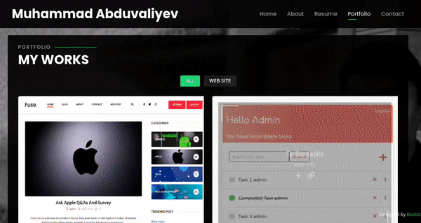

# Portfolio Project

### This is a site made by HTML, CSS, Bootstrap and Django

# Muhammad Abduvaliyev

## Description 

***This site is a home page for my portfolio. It is the first independent project from Muhammad. It will show previous work history, schools attended and have links to my Github page.***

# Contact Details
***email:*** [abduvaliyevmuhammad41@gmail.com](mailto:abduvaliyevmuhammad41@gmail.com)
***phone:*** +998 (93) 889-12-04

# Pages

## HOME
In this page you can get my social links.

   

## ABOUT
This page gives information about me(skill, interests). 

   

## RESUME
This is resume page. In this page you can get information about my education.

   

## PORTFOLIO
This is resume page. In this page you can get information about my education.

   

## CONTACT
In this page you can contact with me.

   

# Technologies Used
* ***Django***
* ***Pillow***
* ***sentry***
* ***HTML***
* ***CSS***
* ***Bootstrap***

